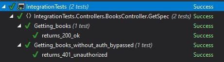

# Bypassing Authentication and Authorization in Integration Tests

When writing integration tests for a web service that has both authentication and authorization,
you either need to configure your test host environment to bypass authentication and authorization,
or hook your test project into a real identity system, e.g. Identity Server. I generally prefer
not to unnecessarily couple my integration tests to a real system in this way - not only does it
pollute said system with configuration specific to the testing of an application, it also slows
the application down (real network calls) and causes tests to fail when there is an outage on the
identity side. Authentication and authorization are important to test, but you don't need to do it
on every integration tset.

This repository demonstrates how to avoid this coupling by bypassing authentication and authorization
constraints in tests.

## Process

1. Configure Startup in your API host to enable bypassing authentication/authorization configuration
See [here](IdentityServer/Startup.cs#L23) for an example.
2. Override this method in a *TestStartup* class (which derives from *Startup*) to register fake handlers.
Examples of how to fake this are available [here](IntegrationTests/Infrastructure/Security), with example
usage [here](IntegrationTests/Infrastructure/Hosting/TestStartup.cs).
3. Configure *WebApplicationFactory* to use *TestStartup* in your tests.
[Here](IntegrationTests/Infrastructure/Hosting/MyWebApplicationFactory.cs) is an example of how to
configure this, and [here](IntegrationTests/Controllers/BooksController/GetSpec/Getting_claims.cs#L17)
is an example of how to use it.

## Additional details

There are two tests in this example. Taken together these demonstrate that the bypass works; one to
show that not using it yields a 401, and another to show that using it yields a 200.

