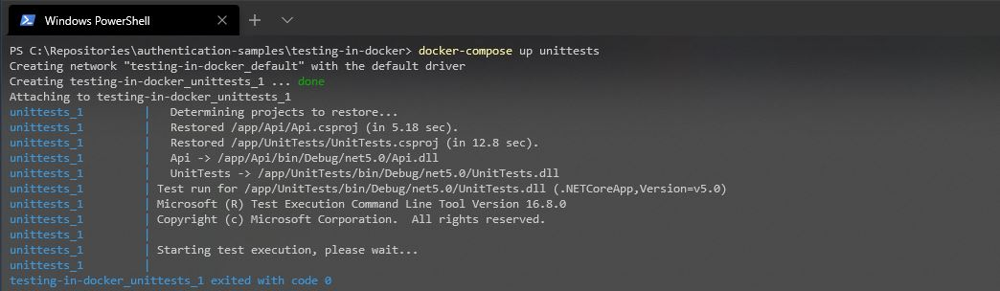
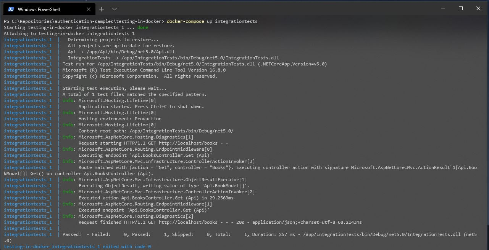
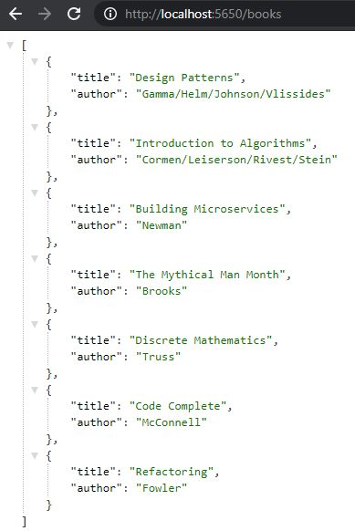

# Running Tests in Docker Containers

Todo

Why - cos why not / runnable tests with less dependency requirements on the build server / enable
tests that involve multiple hosted dependencies

What - explain stuff

How to run the sample

Build images using `docker-compose build`

Run unit tests with `docker-compose up unittests`

Run integration tests `docker-compose up integrationtests`

or `docker-compose up webapi` and browse to http://localhost:5650/books in your browser

